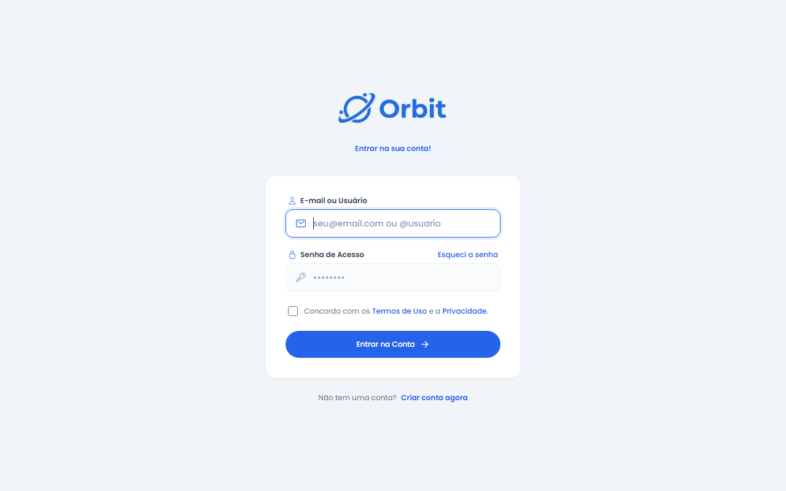
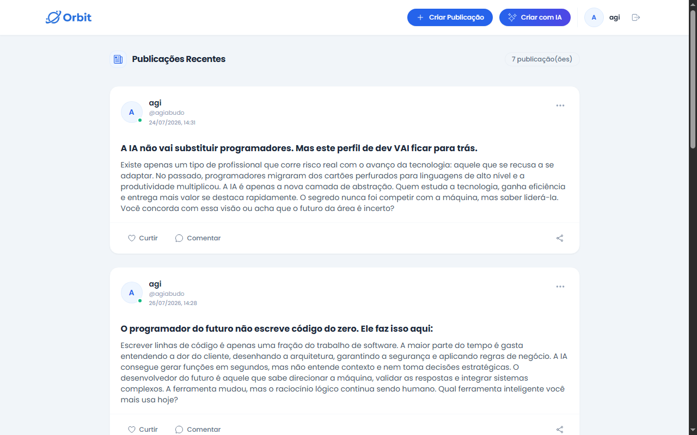
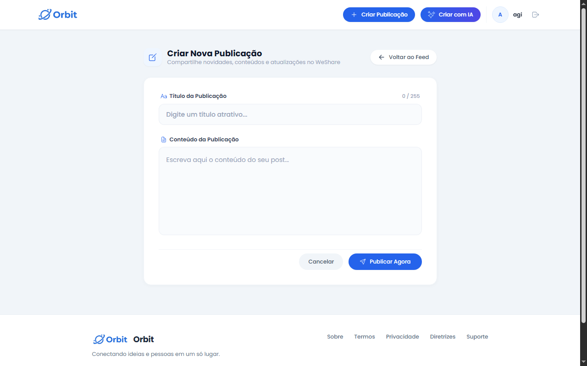
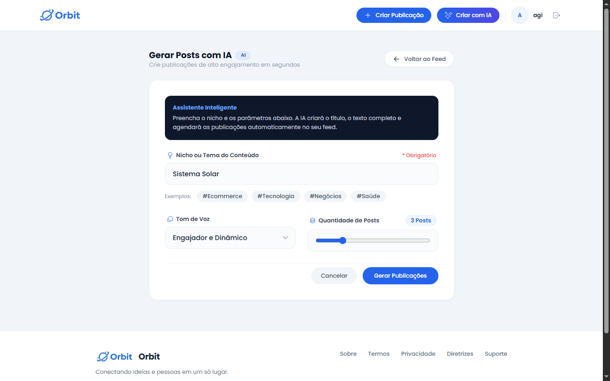

# Orbit Social

Orbit Social is a lightweight social network built with **PHP - Custom Framework**, allowing users to register, log in, create posts, and generate AI-powered posts using **Google Gemini AI**.

---

## ✨ Features

- User Registration
- User Login
- User Logout
- Create Posts
- Generate Posts Automatically with AI (Google Gemini)

---

## 🛠️ Technologies

- PHP (PHP - Custom Framework)
- MySQL (MySQLi)
- Tailwind CSS (CDN)
- JavaScript
- Ionicons
- Poppins Font
- Google Gemini AI

---

## 🚀 Getting Started

### 1. Clone the repository

```bash
git clone https://github.com/agiabudomz/orbit-social.git
```

Or download the project as a ZIP file and extract it into your web server directory.

---

### 2. Configure the environment

create the `.env` file in the project root and configure it as shown below.

```env
# Application Setup
APP_NAME="Orbit Social"
APP_ENV=development or production
APP_URL=http://localhost/orbit-social/

# Database Credentials
DB_HOST=localhost
DB_DATABASE=orbit_db
DB_USERNAME=root
DB_PASSWORD=""

# External Services
# A valid Google AI Studio API Key is required
# only if you want to use AI-generated posts.

GEMINI_AI_KEY="YOUR_GEMINI_API_KEY"
```

> **Important**
>
> Replace `APP_URL` with the local or production URL where the project will run.

---

## 🤖 Google Gemini AI

To use the **Create with AI** feature, you must obtain a valid API Key from **Google AI Studio** and set it in the `.env` file.

Without a valid API Key, AI-generated posts will not work.

---

## ▶ Running the Project

1. Configure the `.env` file.
2. Start your Apache server.
3. Open the project URL in your browser.

Example:

```
http://orbit-social.test or http://localhost/orbit-social/

```

---

## 🗄 Database Setup

### Recommended

Create the database manually using the same name configured in your `.env` file.

Example:

```
orbit_db
```

After creating the database, open the following route:

```
/rebuilddb
```

This route will automatically create all required tables.

Example:

```
http://orbit.test/rebuilddb
```

After the process is complete, your application is ready to use.

---

## 👑 Administrator Account

The **Create with AI** button is only visible to administrators.

To make a user an administrator, update the `users` table:

```sql
UPDATE users
SET is_admin = 1
WHERE id = YOUR_USER_ID;
```

or set the value manually:

```
is_admin = 1
```

After logging in again, the **Create with AI** button will automatically appear.

---

## 📌 Available Features

- Register new users
- Login
- Logout
- Create manual posts
- Generate AI-powered posts
- Responsive interface

---

## 📁 Project Structure

```
orbit-social/
├── assets/
├── components/
├── config/
├── core/
├── models/
├── pages/
├── routes/
├── uploads/
├── vendor/
├── .env
├── .htaccess
├── composer.json
├── composer.lock
└── index.php
```

---
## 📸 Screenshots

### 🔐 Login

User authentication page where users can access their accounts.



---

### 📰 Feed

Main feed where users can view published posts.



---

### ✍️ Create Post

Page for creating manual posts.



---

### 🤖 Create Post with AI

AI-powered post creation using Google Gemini.



## 📋 Requirements

- PHP 8.1+
- Apache
- MySQL
- Google Gemini API Key (optional, required only for AI posts)

---

## 📄 License

This project is available for educational and personal use.
